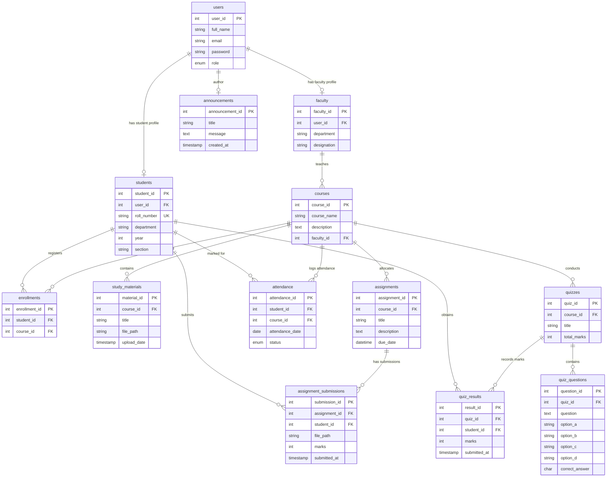
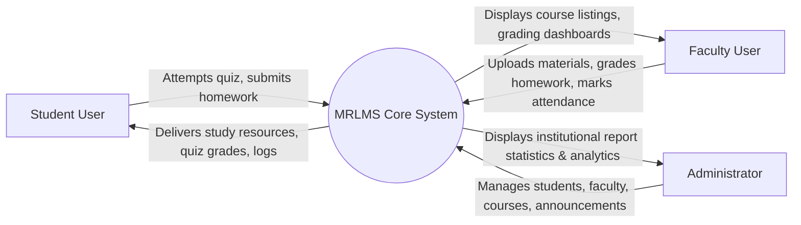
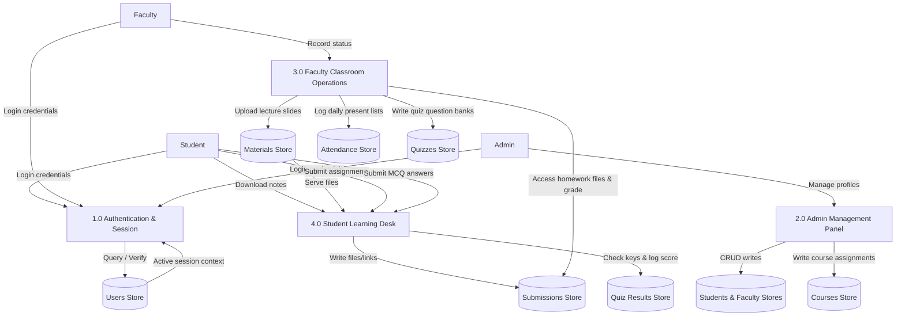
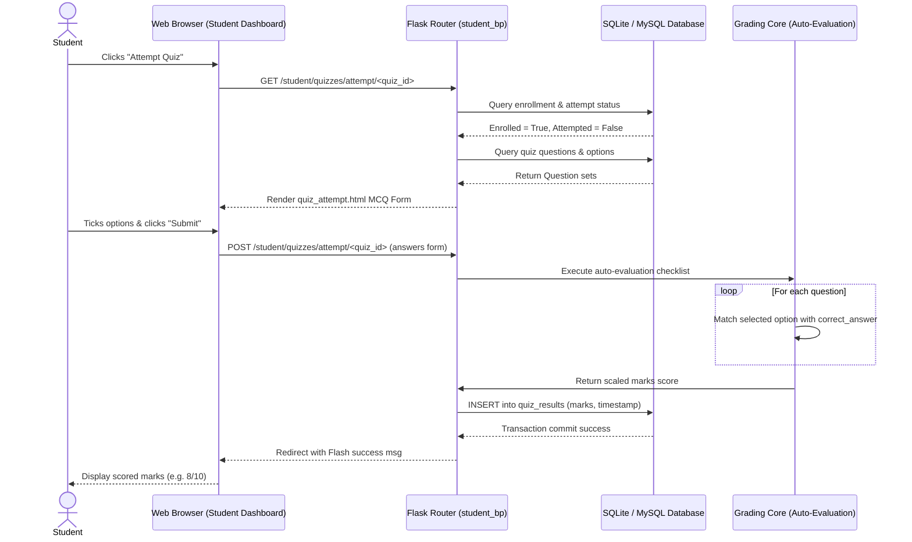

# MRLMS System Diagrams

This document contains Mermaid-based system diagrams for the Multi-Role Learning Management System. These diagrams render dynamically in markdown viewers that support Mermaid syntax.

---

## 1. Entity-Relationship Diagram (ERD)



---

## 2. Use Case Diagram

```mermaid
graph TD
    subgraph Users
        Admin[Administrator]
        Fac[Faculty Staff]
        Stud[Student]
    end

    subgraph MRLMS Use Cases
        UC1(Login & Session Management)
        UC2(Manage Student Registry)
        UC3(Manage Faculty Registry)
        UC4(Create & Assign Courses)
        UC5(Broadcast Announcements)
        UC6(View Analytics Dashboard)
        UC7(Upload Study Materials)
        UC8(Mark Daily Attendance)
        UC9(Create Assignments & Grade Submissions)
        UC10(Create MCQs Quizzes)
        UC11(Download Study Materials)
        UC12(Submit Homework Assignments)
        UC13(Attempt Interactive Quizzes)
        UC14(View Personal Attendance & Marks)
    end

    Admin --> UC1
    Admin --> UC2
    Admin --> UC3
    Admin --> UC4
    Admin --> UC5
    Admin --> UC6

    Fac --> UC1
    Fac --> UC7
    Fac --> UC8
    Fac --> UC9
    Fac --> UC10
    Fac --> UC5

    Stud --> UC1
    Stud --> UC11
    Stud --> UC12
    Stud --> UC13
    Stud --> UC14
```



---

## 3. System Architecture Diagram

```mermaid
graph TD
    subgraph Presentation Layer (Client Side)
        UI[Web Browser - HTML5/CSS3/Bootstrap 5]
        Chart[Chart.js Rendering Engine]
    end

    subgraph Application Layer (Flask Backend)
        Blueprint[Flask Blueprints]
        Auth[Authentication & Flask-Login Manager]
        ORM[SQLAlchemy ORM Mapping]
        RouteAdmin[Admin routes CRUD]
        RouteFac[Faculty routes grading/upload]
        RouteStud[Student routes homework/quiz]
    end

    subgraph Data Layer (Database)
        MySQL[(MySQL Production DB)]
        SQLite[(SQLite Development DB)]
    end

    UI --> Blueprint
    Chart --> RouteAdmin
    Blueprint --> Auth
    Auth --> ORM
    RouteAdmin --> ORM
    RouteFac --> ORM
    RouteStud --> ORM
    ORM --> MySQL
    ORM --> SQLite
```

---

## 4. Data Flow Diagram (DFD)

### Level 0: Context DFD


### Level 1: Functional DFD


---

## 5. Sequence Diagram: Student Quiz Attempt & Auto-Evaluation


